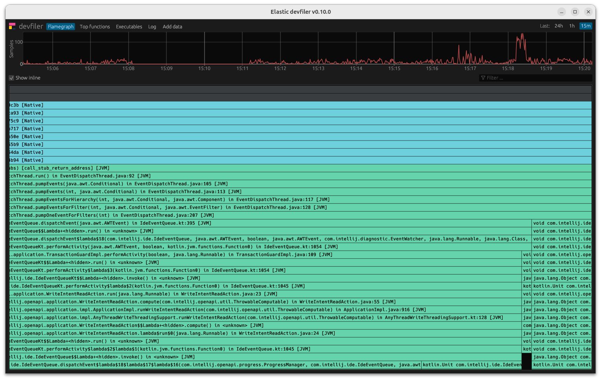

# Unboxing OpenTelemetry eBPF Profiler

```
git clone https://github.com/open-telemetry/opentelemetry-ebpf-profiler.git \
  .unboxing/opentelemetry-ebpf-profiler
cd .unboxing/opentelemetry-ebpf-profiler
```

Build the Docker image containing the build environment:

```
make docker-image
```

Build the agent for your current machine's archtecture:

```
make agent
```

Download and unpack the application called "devfiler" that allows visualizing
the profiling agent's output locally.

https://upload.elastic.co/d/08ee5a08cdd4587d8db617e5b0a468667d3eda4698d30f78012077fbe5dc7a45

Authentication token: `68af26a155e25501`.

```
tar xvf devfiler-v0.10.0.tar.gz
```

```
sudo ./devfiler-appimage-$(uname -m).AppImage
```

The devfiler application spins up a local server that listens on `0.0.0.0:11000`.

Now you can start the agent with the following command:

```
sudo ./ebpf-profiler -collection-agent=127.0.0.1:11000 -disable-tls
```

The agent loads the eBPF program and its maps, starts unwinding and reports
captured traces to the backend.



```
cat <<EOF >> ebpf-profiler.Dockerfile
FROM alpine:latest

RUN apk --no-cache add ca-certificates # from gcc on, only for dev
WORKDIR /root/
COPY ./ebpf-profiler .
RUN chmod +x ./ebpf-profiler

ENTRYPOINT ["/root/ebpf-profiler"]
EOF
```

```
docker build -t ebpf-profiler -f ebpf-profiler.Dockerfile .
```

```
docker volume create --driver local --opt type=debugfs --opt device=debugfs debugfs
```

```
docker run --rm --name ebpf-profiler \
  --volume debugfs:/sys/kernel/debug:rw \
  --volume /sys/kernel/btf/vmlinux:/sys/kernel/btf/vmlinux:ro \
  --privileged --net=host --pid=host \
  ebpf-profiler -collection-agent=127.0.0.1:11000 -disable-tls
```

or

```
docker run --rm --name ebpf-profiler \
  --volume /sys/kernel/debug:/sys/kernel/debug:rw \
  --volume /sys/kernel/btf/vmlinux:/sys/kernel/btf/vmlinux:ro \
  --privileged --net=host --pid=host \
  ebpf-profiler -collection-agent=127.0.0.1:11000 -disable-tls
```
